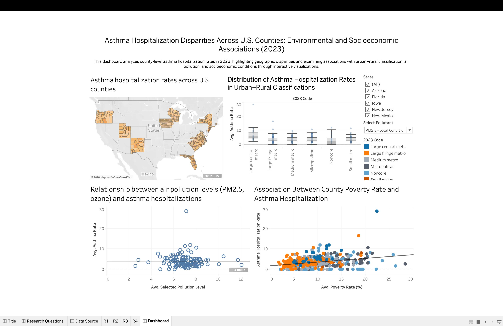

# U.S. Asthma Hospitalization & Environmental Risk Analysis

## Objective
Analyze county-level asthma hospitalization rates across the U.S. and evaluate the impact of air pollution and socioeconomic factors using multi-source public datasets.

## What This Project Demonstrates
* Multi-source data integration (CDC, EPA, USDA, ACS)
* FIPS-based dataset standardization & join validation
* Interactive parameterized dashboard design
* Exploratory correlation analysis (pollution vs health outcomes)
* Public health–oriented data storytelling

## Data Sources
* CDC Environmental Public Health Tracking
https://ephtracking.cdc.gov
* EPA Air Quality System (PM2.5, Ozone)
https://www.epa.gov/aqs
* USDA Rural–Urban Continuum Codes
https://www.ers.usda.gov/data-products/rural-urban-continuum-codes/
* U.S. Census Bureau – American Community Survey
https://data.census.gov
All datasets were cleaned and joined using standardized 5-digit county FIPS codes.

## Dashboard Capabilities
* County-level choropleth map of asthma hospitalization rates (with null indicators)
* Box plot distribution of hospitalization rates across Rural–Urban Continuum (2023 Code) classifications
* Pollution vs hospitalization scatter plot with dynamic pollutant selection (PM2.5 / Ozone)
* Poverty rate vs hospitalization scatter plot with classification-based color encoding and trend line
* Interactive state filtering and parameter control panel

## Key Findings
* Significant variation in asthma hospitalization rates across counties.
* Urban counties show higher hospitalization rates than rural counties.
* Positive relationship observed between PM2.5 levels and hospitalization rates.
* Higher poverty and lower insurance coverage correlate with worse outcomes.

## Tech Stack
* Tableau
* Excel (data cleaning & FIPS standardization)
* GitHub

## Walkthrough
See  for a full demo of dashboard interactivity and insights.

## Repository Contents
```
asthma-hospitalization-analysis/
├── asthma_dashboard.twbx
├── dashboard_walkthrough.mov
├── images/dashboard_preview.png
└── README.md
```
